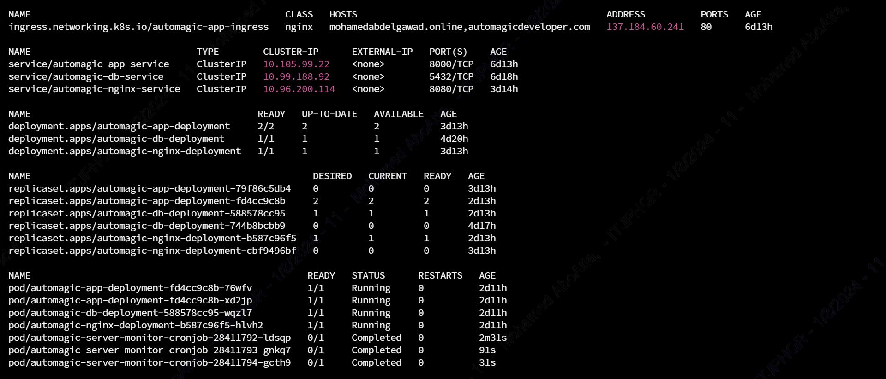
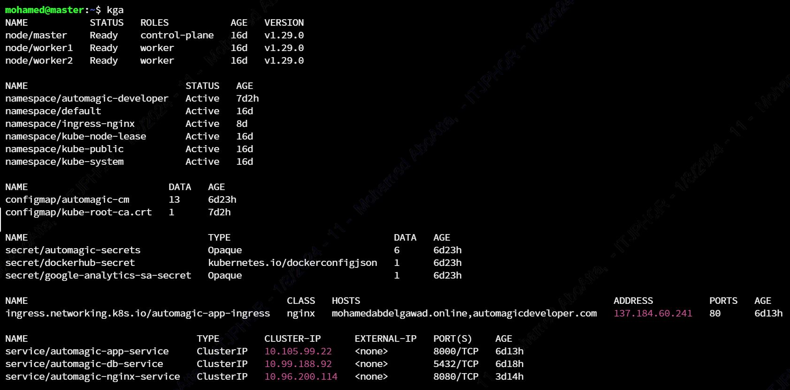
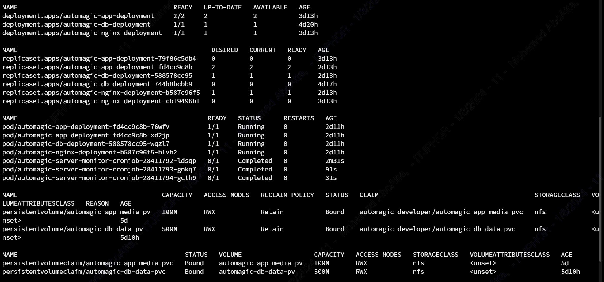
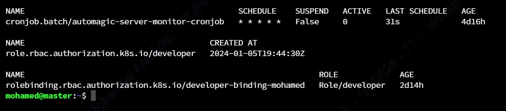

[![LinkedIn][linkedin-shield]][linkedin-url]

<!-- PROJECT LOGO -->
 

  
  <h3 align="center">Automagic Portfolio Stack on Kubernetes</h3>

<!-- TABLE OF CONTENTS -->

  
Table of Contents

  <ol>
    <li><a href="#about-the-project">About The Project</a></li>
    <li><a href="#description">Description</a></li>
    <li><a href="#contact">Contact</a></li>
  </ol>

<!-- ABOUT THE PROJECT -->
## About The Project

* **Project Name:** Automagic Portfolio Stack on Kubernetes
* **Version:** v1.0.0
* **Department:** Technology

---

## Description

This project automates the deployment of my personal portfolio web application stack using Kubernetes. It includes the necessary Kubernetes resources for seamless scaling and management of the stack components. The stack comprises:

* **Web Application:** Developed using Django (Python) for the backend and HTML/CSS/JavaScript/Bootstrap for the front end.
* **Postgres Database:** Handles data storage for the application.
* **Cronjob-based System Monitor:** Periodically gathers system statistics and stores them in the Postgres database for monitoring purposes.

### Kubernetes Resources Created:

- Deployment for the Django web application.
- StatefulSet for the Postgres database ensuring persistent data storage.
- CronJob for running the system monitoring tasks on a scheduled basis.

These resources allow my portfolio to be dynamically scalable and maintain high availability using the advantages of Kubernetes orchestration.

(<a href="#readme-top">back to top</a>)

---

## Contact

Mohamed AbdelGawad Ibrahim - [@m-abdelgawad](https://www.linkedin.com/in/m-abdelgawad/) - <a href="tel:+201069052620">+201069052620</a>

(<a href="#readme-top">back to top</a>)

<!-- MARKDOWN LINKS & IMAGES -->
[linkedin-shield]: https://img.shields.io/badge/-LinkedIn-black.svg?style=for-the-badge&logo=linkedin&colorB=555
[linkedin-url]: https://www.linkedin.com/in/m-abdelgawad/
